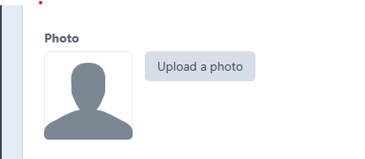

# Account tab


As you are using a Microsoft account to login you will only be able to edit the photo field on this tab&#x20;



Existing users' information has been transferred from [www.wit.ie](http://www.wit.ie) and www.itcarlow.ie. For new users, logging into the system will automatically create an account with basic details&#x20;


## Photo Field

The photo filed is the picture that will appear on you staff profile and on your staff card wherever it is used across the site. We recommend you use a passport style picture&#x20;

<figure><figcaption></figcaption></figure>


&#x20;The image must be.jpg or .png file type&#x20;

&#x20; Not be larger than 9 megabytes (9MB)

&#x20;If the image is too small the quality will be poor it will be stretched and distorted.


<figure><figcaption>
Click to enlarge
</figcaption></figure>

