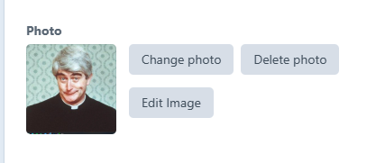

# Image options

Once you have uploaded an image you will have two options,

* Change photo -  swap out the existing photo for a new one&#x20;
* Delete photo - Remove the photo completely
* Edit the image - Make changes to the image

<figure><figcaption>
clikc to enlarge
</figcaption></figure>

