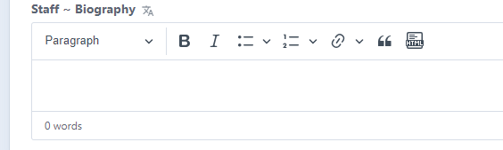
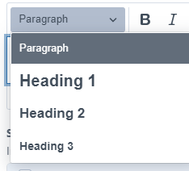
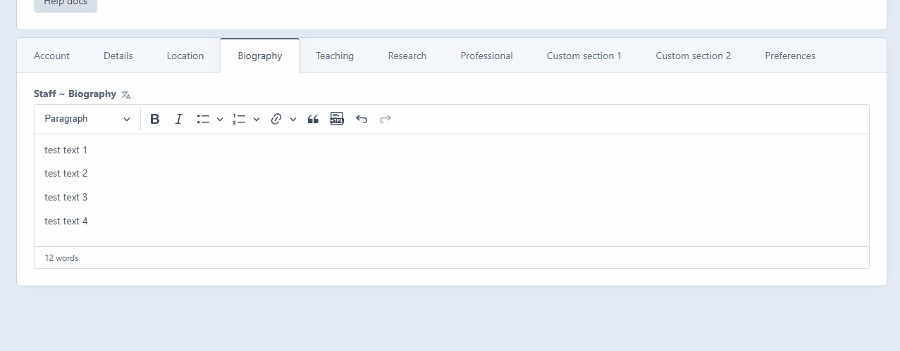
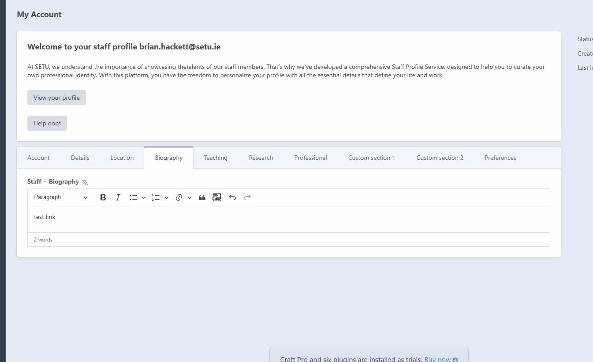
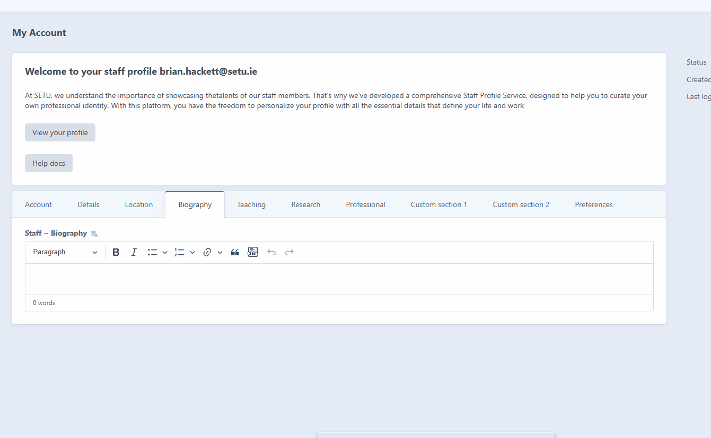

# Biography tab

You can add in your biography details in this text field

<figure><figcaption></figcaption></figure>


To paste text, you can use the keyboard shortcut Ctrl + V or right-click in the box and select "Paste". If you're pasting from a Word document, all text formatting will be preserved.


## Text formatting options&#x20;

<figure><figcaption></figcaption></figure>

### Heading&#x20;

Paragraph is set by default, but you can also use H1, H2 and H3. We recommend H3 for text headings&#x20;

### Bold and Italic

Standard bold and Italic options&#x20;

### Bullets and numbered lists&#x20;

You have the option to incorporate bullet points or numbered lists into your text, and there are various styles available for each type.

<figure><figcaption></figcaption></figure>

### Links&#x20;

You can choose to link either to a page within the SETU website or to an external URL.

<figure><figcaption></figcaption></figure>

### Block quote&#x20;

The feature enables us to format a piece of text in a block quote style.

<figure><figcaption></figcaption></figure>

### HTML option&#x20;

This functionality allows for direct HTML input on the page, simplifying the embedding of various iframes like YouTube videos, flippybooks, forms, or other services compatible with iframes.

<figure><figcaption>
Click to enlarge
</figcaption></figure>
