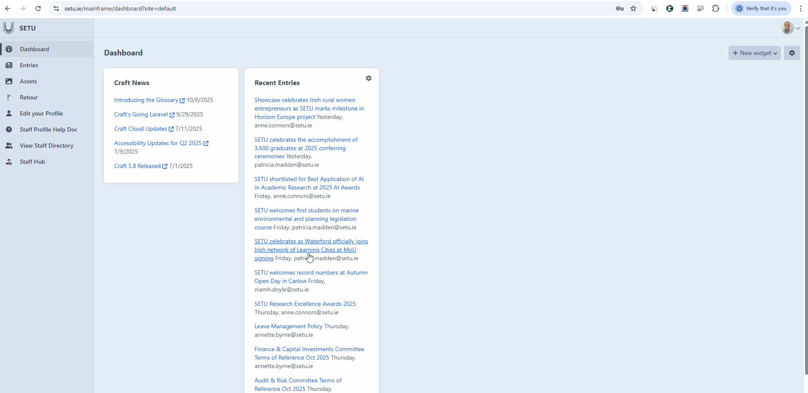

# Dashboard

## Widgets

When a user logs into the CMS, they will land on the dashboard. At first glance, it may seem fairly empty, but this is normal—permissions and roles can limit what appears here. The most important element to be aware of is the **New Widgets** button.

<figure><figcaption></figcaption></figure>

There are several different widget options available that you can use to customise your dashboard and make important tools easier to access. These include **Feed**, which displays recent activity; **Guide**, offering helpful instructions and tips; **My Drafts**, where you can quickly find unfinished content you’re working on; **Quick Posts**, allowing you to create simple updates without navigating deeper into the CMS; **Recent Entries**, which shows the latest published content; and **Retour**, which helps you return to previous areas of the site. By selecting and arranging these widgets, you can tailor the dashboard to suit your workflow and improve efficiency.

<figure><figcaption>
Click to enlarge
</figcaption></figure>

## Feed&#x20;

The **Feed** widget is used for displaying recent activity from a chosen page or news source directly on your dashboard. When a user selects this option, they will be asked to enter the URL of the page they want the feed to pull information from, choose a title that will appear on the widget window, and set a limit for how many items they would like to display at once. This allows users to keep track of updates at a glance without navigating through the CMS. In this example, we created a Craft News feed and set the limit to 5 items, giving a quick and concise overview of the latest updates.&#x20;

<figure><figcaption></figcaption></figure> <figure><figcaption></figcaption></figure>

## Guide&#x20;

The **Guide** widget is designed for users who want to display one of the SETU-created guides directly on their dashboard for quick reference. When selecting this option, the user will be asked which guide they would like to show—currently, the selection is limited to just one available guide. Additionally, there is a toggle switch allowing the user to choose whether or not they want the widget title to be displayed on the dashboard. This widget is useful for keeping important instructions visible and easily accessible while working within the CMS.&#x20;

<figure><figcaption></figcaption></figure> <figure><figcaption></figcaption></figure>

## My Drafts&#x20;

The **My Drafts** widget is used to keep any unfinished content visible right on your dashboard, making it easy to return to and complete later. When configuring this widget, you can choose how many drafts you would like to display at once, allowing you to prioritise the most important or recent items. This helps users stay organised and ensures that ongoing work doesn’t get forgotten within the CMS. For this example, we have not displayed any drafts.&#x20;

<figure><figcaption></figcaption></figure> <figure><figcaption></figcaption></figure>

##
