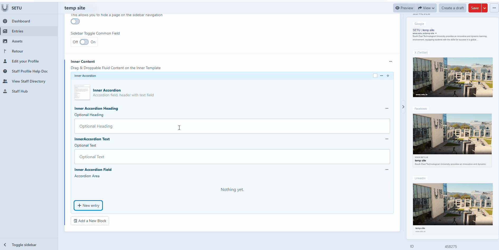

# Inner Accordion

The Inner Accordion works like a small dropdown section that reveals information when someone clicks on it. You can add an optional heading and description outside the accordion to introduce the content, and you can also include a heading and detailed text inside the accordion itself. This makes it a useful tool for organizing information in a compact, interactive way.&#x20;

<figure><figcaption></figcaption></figure>

<figure><figcaption></figcaption></figure>
