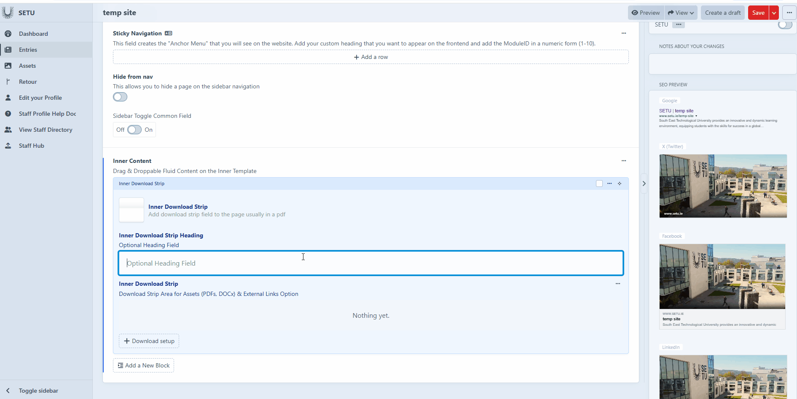

# Inner Download Strip

&#x20;The inner download strip is used to give users a clear and convenient way to access downloadable files directly from the page. While it most often links to documents in PDF format, it can also be configured to provide DOCX files or other supported formats. By adding the download strip field, creators ensure that users can easily retrieve the document in the format that best fits their needs.&#x20;

<figure><figcaption></figcaption></figure>

<figure><figcaption></figcaption></figure>
