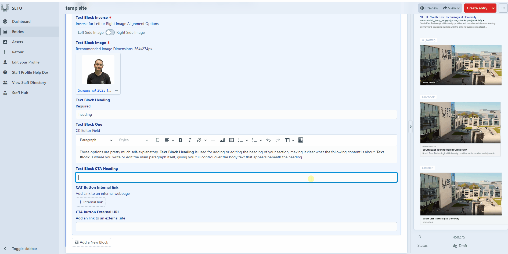

# Landing Fifty-Fifty

The **Inner Text Block (Left/Right)** is used to create a flexible image-and-text layout where an image can sit to the left or right while text flows neatly beside it. Choose the left or right option to control which side the image appears on, and the block will automatically wrap the text around the image for a balanced, magazine-style layout. You can also elongate the block to give the image or the text more space, and enable the optional **CTA (call-to-action) button** to drive clicks — perfect for promos, featured stories, or highlighting key actions directly inside the content.&#x20;

#### Text Block Inverse&#x20;

This flicker is very important because it decides **which side your image goes on**, and the **text will automatically appear on the opposite side**. This ensures a clean, balanced layout where your visual and written content complement each other, making the section easy to read and visually appealing. In this example, we have set the image to the left side.&#x20;

<figure><figcaption></figcaption></figure> <figure><figcaption></figcaption></figure>

#### Text Block Image&#x20;

This is where you add the image you want to use, and it also displays the **recommended pixel dimensions** to ensure the best visual quality. By following the suggested size, your image will appear sharp, properly scaled, and well-aligned within the layout.&#x20;

<figure><figcaption></figcaption></figure>

#### Text Block Heading & Text Block One&#x20;

These options are pretty much self-explanatory. **Text Block Heading** is used for adding or editing the heading of your section, making it clear what the following content is about. **Text Block One** is where you write or edit the main paragraph itself, giving you full control over the body text that appears beneath the heading.&#x20;

<figure><figcaption></figcaption></figure>

#### CTA Button&#x20;

**Text Block CTA Heading** is the text that will appear directly on the button itself, serving as the call-to-action label users will click. **CTA Button Internal Link** is used when you want the button to lead to another page **within the school’s website**, ensuring smooth internal navigation. Meanwhile, **CTA Button External URL** is for linking the button to an **outside website**, allowing users to access external resources or content beyond the school’s site.&#x20;

<figure><figcaption></figcaption></figure>
