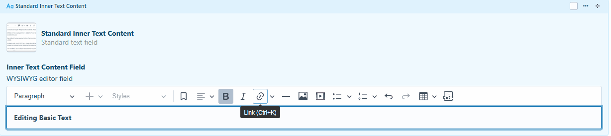
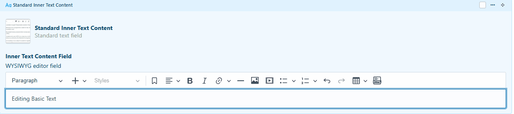
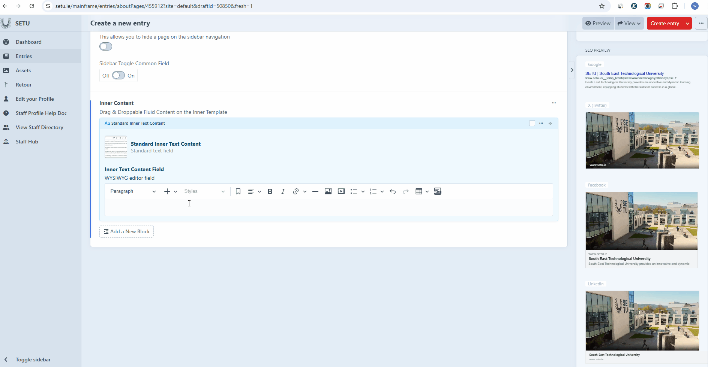
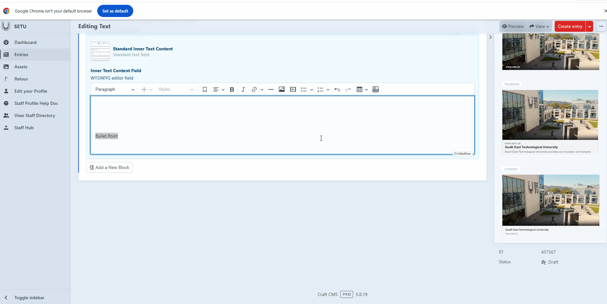

# Editing Text

## Basic text editing

Text can be edited with a set of tools similar to those you would find in Microsoft Word.

**Bold Text**

Adds bold font to **highlighted text.**&#x20;

<figure><figcaption></figcaption></figure>

#### Italic Text

Adds Italic font to _highlighted text._ &#x20;

<figure><figcaption></figcaption></figure>

#### Align Left, Right and Centre&#x20;

Moves all highlighted text to the left, right, or centre.&#x20;

<figure><figcaption></figcaption></figure>

#### Add/Edit a heading&#x20;

Headings are important for your text structure but they are also an SEO trigger. You have a number of header options in the drop down . Header 1 & 2 are very large and not recommended for general text . We recommend using heading 3 for text headings on a page.&#x20;

<figure><figcaption></figcaption></figure>

#### Inserting a Link into text

&#x20;The **link button** allows you to insert hyperlinks into your text by highlighting the portion you want to link and clicking the button. You can use it to connect to an external webpage, or to link directly to another **asset** or **entry** within your content. This makes it easy to create connected, interactive text that guides readers to related information or resources.&#x20;

<figure><figcaption></figcaption></figure>

#### Adding a Horizontal Line &#x20;

This button simply adds a **horizontal line** to your text. It’s a quick way to visually separate sections or ideas within your content, helping to improve readability and organization without adding extra formatting or design elements.

<figure><figcaption></figcaption></figure> <figure><figcaption></figcaption></figure>

#### Adding Bullet Points /Numbered Lists&#x20;

The next two buttons are used for creating **bullet points** or **numbered lists** in your text. These tools help organize information clearly and make your content easier to read. Each button also has a **dropdown arrow** that lets you choose from different list styles, allowing you to customize the appearance to match your preferred formatting or design.&#x20;

<figure><figcaption></figcaption></figure>

#### Creating a Table&#x20;

This button allows you to **create a table** within your text. You can adjust the size of the table by selecting the number of **columns (X)** and **rows (Y)** you want, giving you full control over the table’s structure to suit your content needs.&#x20;

<figure><figcaption></figcaption></figure>

#### HTML Embed&#x20;

HTML embeds allow you to insert custom HTML code directly into your content, giving you greater flexibility and control over what appears on the page. They’re useful for adding interactive elements, external widgets, multimedia, or any specialized content that isn’t supported by the standard editor tools. This lets you enhance your page with more dynamic and customizable features.&#x20;

<figure><figcaption></figcaption></figure>
