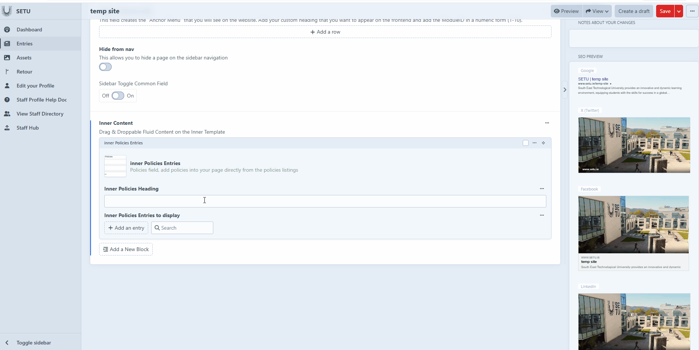

# inner Policies Entries

The Inner Policies Entries option is used to add policies directly into your page from the existing policies listings. Instead of manually recreating or copying policy content, you can pull the entries in automatically, ensuring consistency and saving time. This makes it easy to display up-to-date policy information exactly where it’s needed on your page.&#x20;

<figure><figcaption></figcaption></figure>

<figure><figcaption></figcaption></figure>
