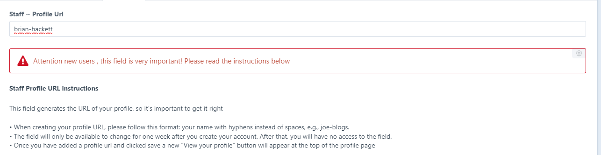
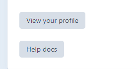

# New users


This section only applies to new users who didn't have an existing staff profile (Waterford site) or staff listing (Carlow site) .&#x20;


### Setting up your staff profile URL&#x20;

When a new user signs in with their SETU account and new profile is automatically setup. For this profile to show the new user needs to setup a profile url&#x20;

The Profile URL is the first field on the detail tab of your profile&#x20;


Users with an existing staff profile will not see this field


<figure><figcaption>
Click to enlarge
</figcaption></figure>

* A new user a create their own profile URL but please follow this format: your name with hyphens instead of spaces, e.g  joe-bloggs
* The profile URL field will only be available to change for one week after you create your account. After that, you will have no access to the field.
* Once you have added a profile url and clicked save a new "View your profile" button will appear at the top of the profile page

<figure><figcaption>
Click to enlarge
</figcaption></figure>

If you have any questions on setting up your new profile please contact webmaster@setu.ie
