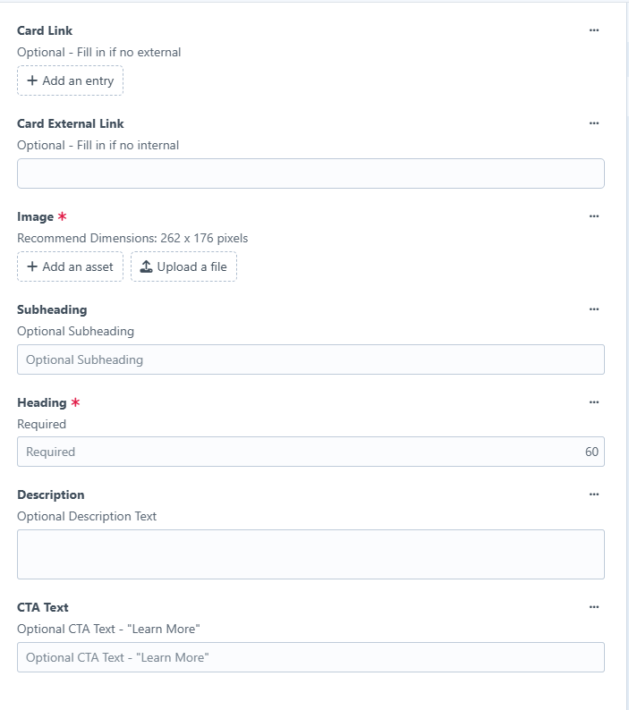
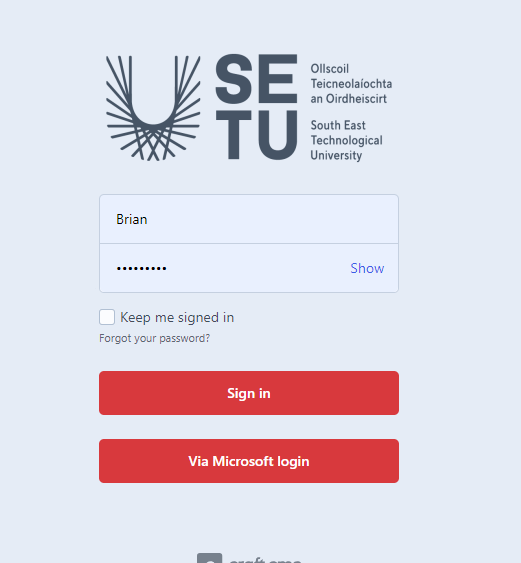

# Password box issue

A small number of users have come across an issue where a password box below appears when they try save their profile changes and this box won't accept your password&#x20;

<figure><figcaption></figcaption></figure>

To fix this issue to need to log out and login again via the Microsoft link . To sign out sign out of your account click on the button in the top left-hand corner and choose sign out button in the top corner

This will bring you to a login page like below  -&#x20;

<figure><figcaption></figcaption></figure>


Click on the via Microsoft login button , you don't need to put in any other details just click the button&#x20;


