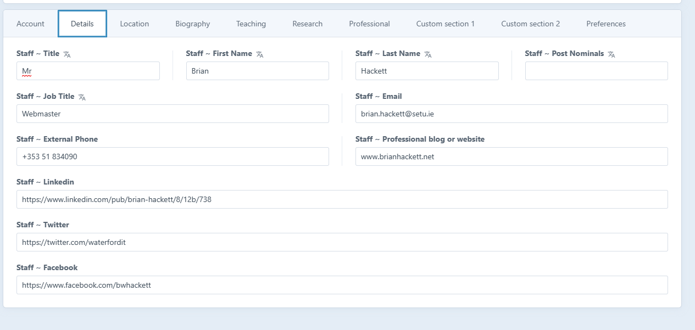

# Details

This section includes essential fields such as name, email, and more


The Professional blog or website and social media fields require valid URLs. Attempting to save with an invalid URL will result in an error and require correction before saving


<figure><figcaption>
Click to enlarge
</figcaption></figure>
