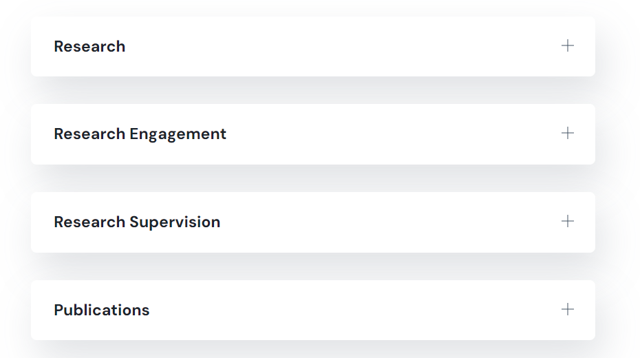

# Reseach tab

### Research BIo&#x20;

Use this field for a general description for your research activity.[ More information on text formatting options](biography-tab.md#text-formatting-options)

<figure><figcaption>
Click to enlarge
</figcaption></figure>

### Reseach links and ORCID number

<figure><figcaption>
Click to enlarge
</figcaption></figure>


Research gate and Pure profile fields require valid URLs. Attempting to save with an invalid URL will result in an error and require correction before saving



The Walton link feature adds a hyperlink to your Walton profile on the walton.ie site . Once again, it necessitates a valid URL.


### Research group dropdowns&#x20;

The research group drop downs allow you to choose the research institute, centres or groups you are involved in. We have two options if you require them. If you are active in more than two or your group or centre is missing from the list, please email webmaster.wd@setu.ie.

### Carlow / Wexford researcher section

These four text fields correspond to the tabs that were present on researcher profiles on the old ITcarlow.ie website. All of that data was imported into the site and should be visible here&#x20;


Waterford staff can use these fields if they wish as there is no reference to Carlow/Wexford in the accordion in the frontend&#x20;


<figure><figcaption></figcaption></figure>
