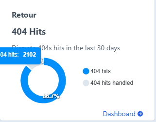

# Inner Three Cards w Image

This option is similar to the last two, but it includes an image and provides space for a short amount of text. The added visual and brief description make it more engaging and informative than the simpler versions, giving users a clearer idea of the content or action being highlighted.&#x20;

<figure><figcaption></figcaption></figure>

<figure><figcaption></figcaption></figure>
